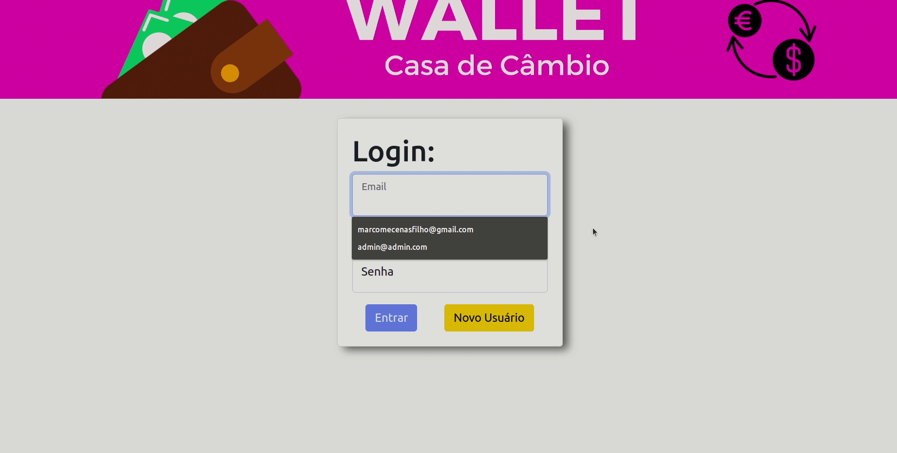
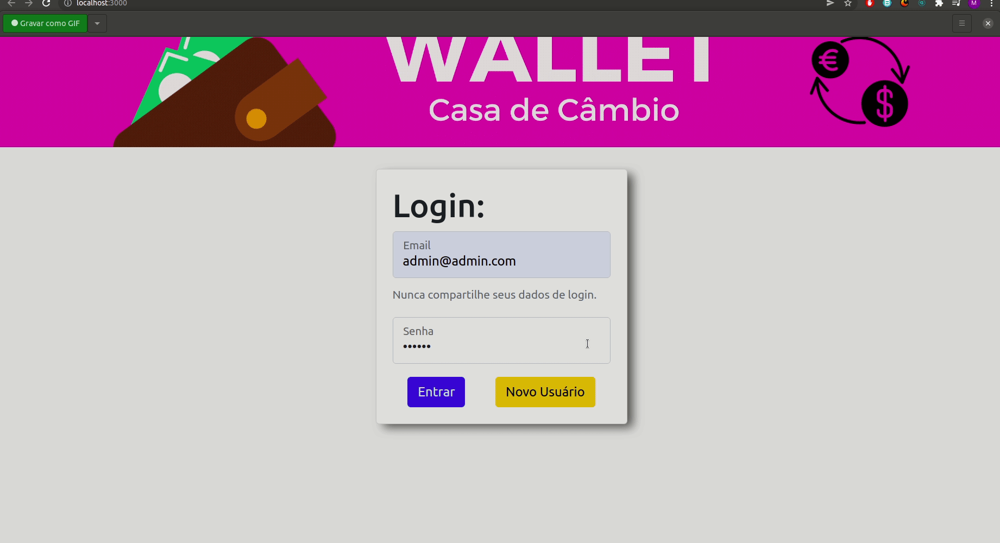

<h1 align="center">Wallet - Casa De Câmbio</h1>
<h4 align="center"> 
	🚧  Wallet - Casa de Câmbio 🚀 Finalizado  🚧
</h4>
<br>
<h2>Sobre</h2>
<p align="justify"> Wallet - Casa de Câmbio - É uma carteira digital desenvolvida para a organização de seus gastos em compras internacionais. Podendo Escolher a categoria, método de pagamento, descrição e moeda daquela dispesa. Sendo tudo convertido para Real/BRL e somado automáticamente.
E sendo possível a edição e exclusão de qualquer despesa. </p 

### Features

-  Cadastro de usuário
-  Cadastro de despesas
-  edição e exclusão das despesas
-  Despesas salvas localmente
-  Soma e conversão(BRL) automáticas
<br>
## 🛠 Tecnologias

As seguintes ferramentas foram utilizadas na construção do projeto:

- [React](https://pt-br.reactjs.org/)
- [JavaScript](https://developer.mozilla.org/en-US/docs/Web/JavaScript/Language_Resources)
- [Redux](https://redux.js.org/)
- [React-BootStrap](https://react-bootstrap.github.io/)
- [Node.js](https://nodejs.org/en/)

<h2>Testar o projeto</h2>
<br>

<div align="center">
<a  href="https://wallet-exchange-office.herokuapp.com/" target="_blank"></a> 
</div>
<br>
<h2>Instalar o projeto em sua máquina</h2>
<br>
<h3>Pré-requisitos</h3>

Antes de começar, você vai precisar ter instalado em sua máquina as seguintes ferramentas:
[Git](https://git-scm.com) e [Node.js](https://nodejs.org/en/). É necessário a utilização de um editor de código, e como recomendação deixo o [VSCode](https://code.visualstudio.com/).


###  Rodando a aplicação web.

```bash
# Clone este repositório
$ git clone git@github.com:MarcoMecenasFilho/Wallet-Exchange-office.git

# Acesse a pasta do projeto no seu terminal/cmd
$ cd Wallet-Exchange-office

# Instale as dependências
$ npm install

# Execute a aplicação em modo de desenvolvimento
$ npm run dev

# A aplicação será aberta na porta:3000 - acesse http://localhost:3000
```
<h2>Utilizando a aplicação</h2>
<p align="justify">A tela inicial da aplicação é a página de login. Onde você adiciona seus dados e entra na carteira em si. Não existe servidores. Então todo o sistema de autenticação é simulado utilizando o localStore. E nenhuma informação é realmente enviada para algum lugar. E caso você não tenha um login, ou tenha esquecido. É só criar um novo usuário.</p>

<br>
<p align="justify">Para criar um novo usuário, basta clicar no botão, e adicionar um email qualquer com formato valido(@ e .com) e uma senha que seja maior que 6 caracteres. Lembrando que não existe backEnd. Todo o sistema de login é uma simulação. Recomendo a utilização de dados fictícios. </p>

<br>
<p align="justify">Quando efetuamos o Login, somos enviados para a página da carteira. Sendo muito simples sua utilização. Inserimos os dados que desejamos no forms e clicamos no botão de adicionar. Caso desejamos editar essa despesa, clicamos no botão de editar, onde cada despesa possui o seu. Inserimos os novos dados e editamos. Mas caso deseje excluir, apenas clique no botão de excluir na despesa.</p>

<br>
<p align="justify"> As despesa são armazenadas no localStore. Então caso feche seu navegador ou até mesmo desligue seu computador. Elas permaneceram salvas. Criar um novo usuário também não as modifica. </p>

### Rodando os testes
```bash
# Para rodar os testes, use o comando
$ npm run test

```

## 📝 Licença

Este projeto foi feito com muita dedicação e carinho por Marco Mecenas  [Entre em contato!](https://www.linkedin.com/in/marcomecenasfilho/)
<p align="justify">Foi utilizado o projeto Trybe-Wallet como inspiração.  Sendo ele desenvolvido durante minha formação de desenvolvedor web FullStack na <a href="https://www.betrybe.com/" target="_blank">Trybe</a>.</p>
